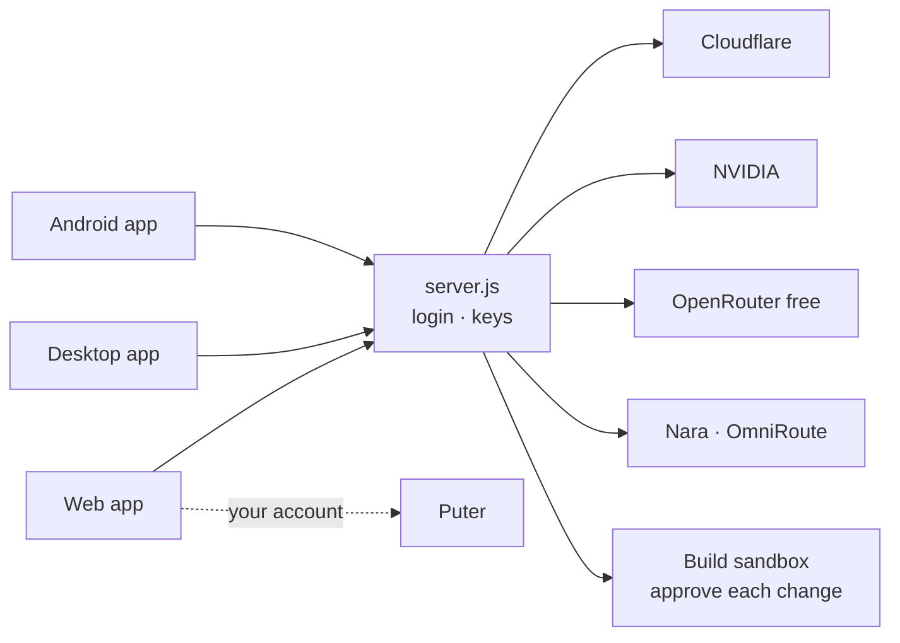

<p align="center">
  
</p>

<p align="center">
  <a href="#-quick-start"></a>
  <a href="docs/deploy.md"></a>
  <a href="https://github.com/tradernonymous/freeopenai/releases/tag/apk-latest"></a>
  <a href="https://github.com/tradernonymous/freeopenai/releases/tag/desktop-latest"></a>
  <a href="#-docs"></a>
</p>

<p align="center">
  <a href="https://github.com/tradernonymous/freeopenai/actions/workflows/ci.yml"></a>
  <a href="https://github.com/tradernonymous/freeopenai/actions/workflows/android.yml"></a>
  <a href="https://github.com/tradernonymous/freeopenai/actions/workflows/desktop.yml"></a>
  <a href="https://github.com/tradernonymous/freeopenai/releases/tag/apk-latest"></a>
  <a href="https://github.com/tradernonymous/freeopenai/actions/workflows/ci.yml"></a>
  
  
</p>

## ✨ What you get

| 💬 **Chat** | 🧩 **Plan · Build** | 🛠️ **Remote builds** |
| :-- | :-- | :-- |
| Puter, Cloudflare, NVIDIA, OpenRouter, Nara, OmniRoute — plus **Kilo Code and OVHcloud, no key at all**. Web search built in. Bring your own MCP server for extra tools. | One switch. **Build edits files on the server, runs tests and git** — you approve every change. Skills, tasks, GitHub tools. | Search, read, edit, run, commit on your server. Approve from any device. |
| 📲 **Android** | 🖥️ **Windows** | 🖼️ **Images** |
| Real tabs — **Chat · Images · Tools · Skills · Library · Settings** — each keeping its own place. Chat · Plan · Build toggle — Build edits this chat's own files, staged for your approval. Puter models, remote builds with approvals. A dropped connection retries the reply on its own once you're back online. | One `.exe`. Builds panel beside the chat, and it says when a newer one is out. | Free FLUX first, now with Pollinations.ai and Gemini too. Puter only when you switch it on. |

**Free models only, limits on the row.** The picker shows what a free tier allows — `free · 2/min · per IP · shared` — and Settings → Chat hides metered rows. A rate-limited provider is waited on only as long as the turn is worth: past `RATE_LIMIT_RETRY_BUDGET_MS` the work moves to another provider, so a task pauses instead of stopping. See [Configuration](docs/configuration.md) and [Free models, no key](docs/free-services.md).

**Coding tasks that finish.** A tool call written as text still runs. Build's workspace *is* the server folder the shell runs in, so a written file is the file `npm test` runs and `git commit` records — as your connected GitHub account, force pushes refused. `plan_actions` runs a whole plan in one model call, approvals unchanged. `/makeskill` turns a finished job into a reusable skill. Build gets 60 tool steps a turn; a remote build gets 120 turns. See [Modes & tools](docs/modes-and-tools.md) and [Remote builds](docs/builds.md).

<details>
<summary><b>🆕 What shipped lately</b></summary>

| | |
| :-- | :-- |
| **Arena mode** | A Session-panel switch fans your next message to a few already-configured providers at once, each streaming into its own bubble — pick the best reply instead of guessing which model to ask. |
| **MCP client** | Point the app at any Streamable-HTTP MCP server (Settings → MCP) and its tools join the model's toolbox for that chat — no server restart, no SDK. |
| **Two more free image providers** | Pollinations.ai (no key, no signup) and Gemini's native image model join the free draw order automatically once configured. |
| **Share a chat** | Every chat gets a ↗ button: publish a frozen, read-only link anyone can open — no account needed to read — and revoke it whenever. Set `SHARE_STORE_PATH` on a persistent volume and links survive redeploys. |
| **Memory** | The model saves small facts (Session → Memory shows them); every chat offers them as context, and you can switch it off per chat or forget anything. |
| **Android real tabs** | Chat, Images, Tools, Skills, Library and Settings are peer destinations now — switching back resumes exactly where you left each one. |
| **Android offline queue** | A reply that failed because the connection dropped retries itself the moment you're back online, instead of sitting on a dead error. |
| **Android empty states act** | "No builds yet" starts a plan; an empty skill list refreshes — one tap instead of a dead end. |
| **Android Library** | Skills, personas and prompts search as one destination now, instead of two overlapping hubs. |
| **Android Build mode** | Build now edits this chat's own files on the phone — proposed changes wait in a review sheet until you tap Apply. |
| **Android Compare** | A toggle beside the composer asks a second model the same question and shows both replies side by side. |
| **Android swipe gestures** | Swipe a build change to approve or reject it, swipe a chat left to archive it, pull down on Builds to refresh. |
| **Android tablet layout** | On a wide screen, the Build screen pins the pending decision beside the timeline instead of scrolling past it. |
| **Android device control** | Off by default; turned on in Settings, it lets a chat tap or scroll something on screen by its label — always with a tap to approve first. |
| **Text tool calls run** | A tool call a model writes as text gets executed, not printed. |
| **`plan_actions`** | One model call plans the whole sequence; execution is deterministic. |
| **`/makeskill`** | Turn the job you just finished into a skill you can call again. |
| **Puter on Android** | Puter models in the phone's picker, streamed through the app's own bridge. |
| **Chat · Plan toggle** | Always visible on the phone, with a chip for each skill in use. |
| **Launcher update notice** | The desktop `.exe` says when a newer one is published. |
| **Native Tauri desktop** | Replaced the old Edge webview wrapper with a real Tauri 2 + React shell: native sidebar, menus, system tray, and a proper Windows EXE installer. |

</details>

## 🚀 Quick start

```bash
git clone https://github.com/tradernonymous/freeopenai.git
cd freeopenai && npm install && npm start   # → http://localhost:3000
```

<details>
<summary><b>Run the checks</b></summary>

```bash
npm test        # node --test
npm run lint    # eslint
npm run smoke   # clean-profile Chrome check (Node 22+)
```

</details>

> [!TIP]
> Nothing is required to start. Add keys and a login later — see [Configuration](docs/configuration.md).

## ☁️ Deploy

1. Push to GitHub.
2. Railway → **New Project → Deploy from GitHub repo**.
3. Set `AUTH_USER_1`, `AUTH_PASS_1`, `SESSION_SECRET` and your provider keys.

<details>
<summary><b>Is my deploy current?</b></summary>

```bash
curl -s https://<project>.up.railway.app/api/health
```

`commit` must match `git rev-parse main`. `uptimeSeconds` resets on every deploy. More in [Deploy](docs/deploy.md).

</details>

## 📲 Android app

1. On the phone, open **[apk-latest](https://github.com/tradernonymous/freeopenai/releases/tag/apk-latest)**.
2. Tap `neuraos.apk` → **Install**.
3. Sign in once. Updates are offered in the app.

> [!NOTE]
> Puter sign-in inside apps needs a Puter username and password. Google sign-in is blocked in app browsers.

## 🖥️ Desktop app (Windows)

**Download:** [desktop-latest](https://github.com/tradernonymous/freeopenai/releases/tag/desktop-latest)

1. Download the installer from **[desktop-latest](https://github.com/tradernonymous/freeopenai/releases/tag/desktop-latest)**.
2. Double-click. On *"Windows protected your PC"*: **More info → Run anyway**. The installer sets up the WebView2 runtime automatically if the machine lacks it.
3. Sign in once if the engine asks. `Alt+1…5` switches between Chat, Code, Design, Library and Settings; `Ctrl+K` reaches everything else. More in [Desktop](docs/desktop.md).

> **Note:** A native Tauri 2 + React app with its own sidebar and tray. Streaming chat, image generation, live build approvals and skills — all on the NeuraOS engine, with the keys staying on the server.

## 🛠️ Remote builds

Plan → **Build** → approve each change. Commands (tests, git) need `WORKSPACE_RUN=1` on the server. Details in [Remote builds](docs/builds.md).

## 🧭 How it fits



## 📚 Docs

| | | |
| :-- | :-- | :-- |
| 📖 [Features](docs/features.md) | ⚙️ [Configuration](docs/configuration.md) | 🧩 [Modes & tools](docs/modes-and-tools.md) |
| ⌨️ [Using the app](docs/usage.md) | ☁️ [Deploy](docs/deploy.md) | 🖼️ [Image providers](docs/providers.md) |
| 📲 [Android app](docs/android.md) | 🔀 [OmniRoute](docs/omniroute.md) | 🏗️ [Architecture](docs/architecture.md) |
| 🛠️ [Remote builds](docs/builds.md) | 🖥️ [Desktop app](docs/desktop.md) | 💸 [Free models, no key](docs/free-services.md) |

<details>
<summary><b>⚠️ Disclaimer</b></summary>

Unofficial client, not affiliated with OpenAI, Puter or any provider. Each provider's own terms and limits apply; Puter usage bills your own Puter account. Web chats live in your browser (`localStorage` and IndexedDB); Android chats live encrypted on the phone. Clearing either loses them — there is no server copy.

</details>

<p align="center"><sub>MIT · <a href="#-quick-start">Back to top ↑</a></sub></p>
