<p align="center">
  
</p>

<p align="center">
  <b>A free, serverless chat UI for OpenAI models — no API key, no backend, no bill in your name.</b><br>
  Sign in once through Puter · pick a model · chat · your Puter account covers the usage.
</p>

<p align="center">
  
  
  
  
  
</p>

<p align="center">
  <a href="#quickstart"></a>
  &nbsp;
  <a href="#deploy"></a>
  &nbsp;
  <a href="#features"></a>
</p>

<br>

<a name="contents"></a>

## 🧭 Contents

- ✨ [Features](#features)
- 🧠 [Models](#models)
- ⌨️ [Using the app](#usage)
- 🚀 [Quick start](#quickstart)
- ⚙️ [Configuration](#config)
- ☁️ [Deploy to Railway](#deploy)
- 🏗️ [Architecture](#architecture)
- ⚠️ [Disclaimer](#disclaimer)

<br>

<a name="features"></a>


<br>

<table>
  <tr>
    <td width="33%" valign="top">
      <h3>💬 Chat</h3>
      Ask anything and get a streamed, markdown-rendered reply (bold, lists, code blocks). Copy or retry any response. History saves to your browser and survives a reload.
    </td>
    <td width="33%" valign="top">
      <h3>🔐 Sign in with Puter</h3>
      Google, Telegram, or a Magic Key — no account with this app, no API key, no server-side secret. Your Puter account meters the usage.
    </td>
    <td width="33%" valign="top">
      <h3>🔀 Model switching</h3>
      Swap between GPT-6 Astra, the GPT-5.6 family, GPT-5.4 Nano, and GPT-4o from the header, the Models tab, or Settings. Your pick is remembered next visit.
    </td>
  </tr>
  <tr>
    <td valign="top">
      <h3>📎 Attachments</h3>
      Attach a small text file (<code>.txt .md .csv .json .js .ts .log .yml</code>) and its contents ride along with your next message.
    </td>
    <td valign="top">
      <h3>⚙️ Settings</h3>
      Default model, sign-in state, and a one-click "clear history" — all local, nothing leaves your browser.
    </td>
    <td valign="top">
      <h3>♿ Accessible by default</h3>
      Keyboard navigation on the model picker, a focus-trapped help dialog, and live-region announcements for new messages.
    </td>
  </tr>
  <tr>
    <td valign="top">
      <h3>🖼️ Image generation</h3>
      Toggle the image icon next to the input to generate a picture instead of chatting. Click any result to zoom in or download it.
    </td>
  </tr>
</table>

<br>

<a name="models"></a>


<br>

All served through Puter.js — no OpenAI account or key required on your end.

| Model | Description | Id |
| --- | --- | :---: |
| **GPT-6 Astra** | Newest, most capable — complex reasoning, coding, computer use | `gpt-6-astra` |
| **GPT-5.6 Sol** | Flagship of the 5.6 family | `gpt-5.6-sol` |
| **GPT-5.6 Terra** | Mid-tier | `gpt-5.6-terra` |
| **GPT-5.6 Luna** | Smallest, cheapest of the 5.6 family | `gpt-5.6-luna` |
| **GPT-5.4 Nano** | Fast, cheap — the default | `gpt-5.4-nano` |
| **GPT-4o** | Balanced, general-purpose | `gpt-4o` |
| **GPT-4o Mini** | Fast and cheap | `gpt-4o-mini` |

Puter.js supports several dozen OpenAI model ids beyond this curated list (o1, o3, the GPT-5.x and 4.1 lines, Codex variants, and more) — see the [full list](https://developer.puter.com/tutorials/free-unlimited-openai-api/#list-of-supported-text-generation-models) if you want to wire up additional ones.

> A model id restored from a previous session is checked against this list before use — a stale or tampered value always falls back to the default instead of silently failing.

<br>

<a name="usage"></a>


<br>

| Action | How |
| --- | --- |
| Send a message | Type and press `Enter` (`Shift+Enter` for a newline) |
| Switch model | Click the model pill in the chat header, or open the **Models** tab |
| Attach a file | Paperclip icon — text files only, 200KB max |
| Generate an image | Image icon next to the input — describes what to draw instead of chatting |
| View / download an image | Click any generated image to zoom in, with a download link |
| Copy a reply | Copy icon under any assistant message |
| Retry a reply | Retry icon under any assistant message — resends the same prompt (or regenerates the image) |
| Start a new chat | **New chat** icon, top right — asks for confirmation first |
| Sign in / out | Account icon, top right, or the **Settings** tab |

<br>

<a name="quickstart"></a>


<br>

```bash
git clone https://github.com/tradernonymous/freeopenai.git
cd freeopenai
npm install
npm start
# → http://localhost:3000
```

**Run the tests**

```bash
npm test      # node --test — server logic + shared chat helpers
npm run lint  # eslint
```

<br>

<a name="config"></a>


<br>

Nothing to configure to get running — no API key, no `.env` file. The only variable the server reads:

| Variable | Default | Purpose |
| --- | --- | --- |
| `PORT` | `3000` | Port the static server listens on |

<br>

<a name="deploy"></a>


<br>

```bash
# 1 · push this repo to your own GitHub account (or use it as-is)

# 2 · in Railway: New Project → Deploy from GitHub repo → select the repo

# 3 · Railway auto-detects package.json and runs `npm start` — no env vars needed
```

Your app is live at `https://<project>.up.railway.app` a few seconds later.

<br>

<a name="architecture"></a>


<br>

**Request path.** Browser loads `index.html` → Puter.js authenticates the user and meters usage → the page calls `puter.ai.chat()` directly from the browser → the reply streams back into the chat. `server.js` only ever serves static files — it never sees a message or a model response.

<details>
<summary><b>🗂️ Project layout</b> &nbsp;·&nbsp; click to expand</summary>

```text
index.html      chat UI: markup, styles, and all client-side logic
chatlib.js      shared, dependency-free logic (model list, HTML escaping,
                attachment allowlist) — used by the page and by the tests
server.js       zero-dependency static file server (Node's core http module)
test/           node --test suite for server.js and chatlib.js
```

</details>

<br>


<a name="disclaimer"></a>

## ⚠️ Disclaimer

FreeOpenAI is an unofficial client — it is not affiliated with OpenAI or Puter. Usage is billed to your own Puter account under Puter's terms, not this project's. Conversations are stored only in your browser's `localStorage`; clearing site data or switching browsers loses them.

<p align="center">
  <sub>MIT licensed · Built on <a href="https://puter.com">Puter.js</a> · <a href="#contents">Back to top ↑</a></sub>
</p>
