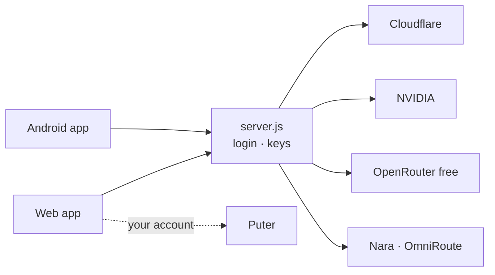

<p align="center">
  
</p>

<p align="center">
  <a href="#-quick-start"></a>
  <a href="docs/deploy.md"></a>
  <a href="https://github.com/tradernonymous/freeopenai/releases/tag/apk-latest"></a>
  <a href="#-docs"></a>
</p>

<p align="center">
  <a href="https://github.com/tradernonymous/freeopenai/actions/workflows/ci.yml"></a>
  <a href="https://github.com/tradernonymous/freeopenai/actions/workflows/android.yml"></a>
  <a href="https://github.com/tradernonymous/freeopenai/releases/tag/apk-latest"></a>
  
  
  
</p>

## ✨ What you get

| 💬 **Chat** | 🧩 **Plan · Build** | 🖼️ **Images** |
| :-- | :-- | :-- |
| Free models: Puter, Cloudflare, NVIDIA, OpenRouter, Nara, OmniRoute. Web search built in. | Task lists, skills, workspace, GitHub tools, optional commands. | Free FLUX first. Puter only when you switch it on. |
| 📲 **Android** | 🔐 **Your login** | ☁️ **One deploy** |
| ChatGPT-style app. Voice mode. Encrypted chats. | Up to 3 accounts. Keys never reach the browser. | Push to `main`. Railway ships it. |

## 🚀 Quick start

```bash
git clone https://github.com/tradernonymous/freeopenai.git
cd freeopenai && npm install && npm start   # → http://localhost:3000
```

<details>
<summary><b>Run the checks</b></summary>

```bash
npm test        # node --test
npm run lint    # eslint
npm run smoke   # clean-profile Chrome check (Node 22+)
```

</details>

> [!TIP]
> Nothing is required to start. Add keys and a login later — see [Configuration](docs/configuration.md).

## ☁️ Deploy

1. Push to GitHub.
2. Railway → **New Project → Deploy from GitHub repo**.
3. Set `AUTH_USER_1`, `AUTH_PASS_1`, `SESSION_SECRET` and your provider keys.

<details>
<summary><b>Is my deploy current?</b></summary>

```bash
curl -s https://<project>.up.railway.app/api/health
```

`commit` must match `git rev-parse main`. `uptimeSeconds` resets on every deploy. More in [Deploy](docs/deploy.md).

</details>

## 📲 Android app

1. On the phone, open **[apk-latest](https://github.com/tradernonymous/freeopenai/releases/tag/apk-latest)**.
2. Tap `freeai4u.apk` → **Install**.
3. Sign in once. Updates are offered in the app.

> [!NOTE]
> Puter sign-in inside apps needs a Puter username and password. Google sign-in is blocked in app browsers.

## 🧭 How it fits



## 📚 Docs

| | | |
| :-- | :-- | :-- |
| 📖 [Features](docs/features.md) | ⚙️ [Configuration](docs/configuration.md) | 🧩 [Modes & tools](docs/modes-and-tools.md) |
| ⌨️ [Using the app](docs/usage.md) | ☁️ [Deploy](docs/deploy.md) | 🖼️ [Image providers](docs/providers.md) |
| 📲 [Android app](docs/android.md) | 🔀 [OmniRoute](docs/omniroute.md) | 🏗️ [Architecture](docs/architecture.md) |

<details>
<summary><b>⚠️ Disclaimer</b></summary>

Unofficial client, not affiliated with OpenAI, Puter or any provider. Each provider's own terms and limits apply; Puter usage bills your own Puter account. Web chats live in your browser (`localStorage` and IndexedDB); Android chats live encrypted on the phone. Clearing either loses them — there is no server copy.

</details>

<p align="center"><sub>MIT · <a href="#-quick-start">Back to top ↑</a></sub></p>
